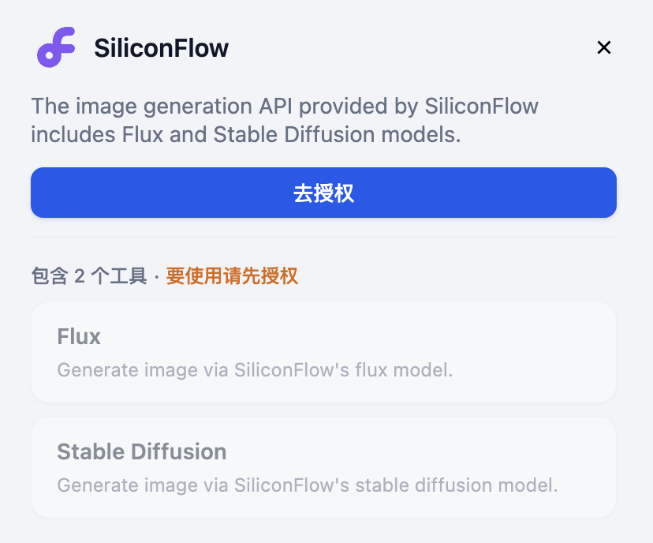

# SiliconFlow

> 工具作者 @Dify

SiliconCloud 基于优秀的开源基础模型，提供高性价比的 GenAI 服务。以下是在 Dify 中配置 SiliconFlow 工具的步骤。

## 1. 申请 SiliconCloud API Key

请在 [SiliconCloud API 管理页面](https://cloud.siliconflow.cn/account/ak) 新建 API Key 并保证有足够余额。

## 2. 在 Dify 内填写配置

在 Dify 的工具页中点击 `SiliconCloud > 去授权` 填写 API Key。

## 3. 使用工具

- Chatflow / Workflow 应用

