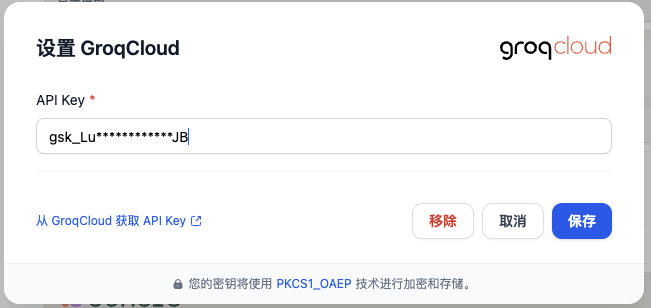
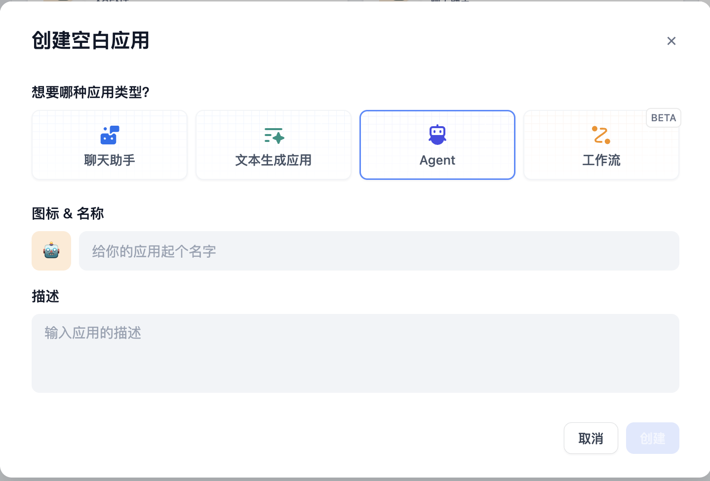
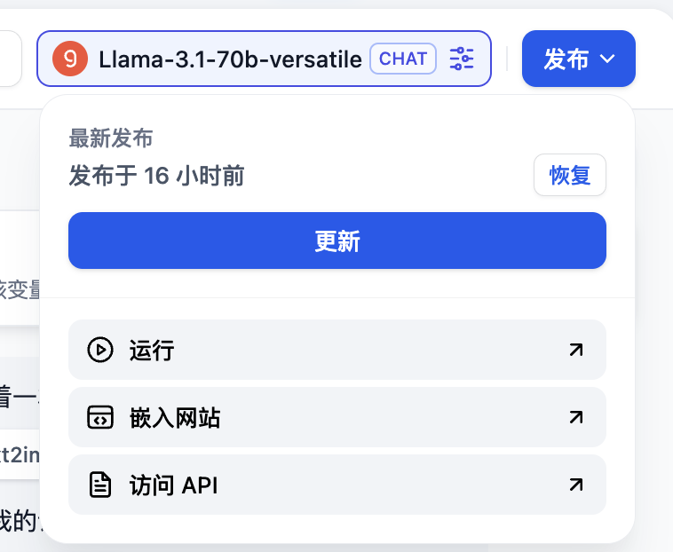
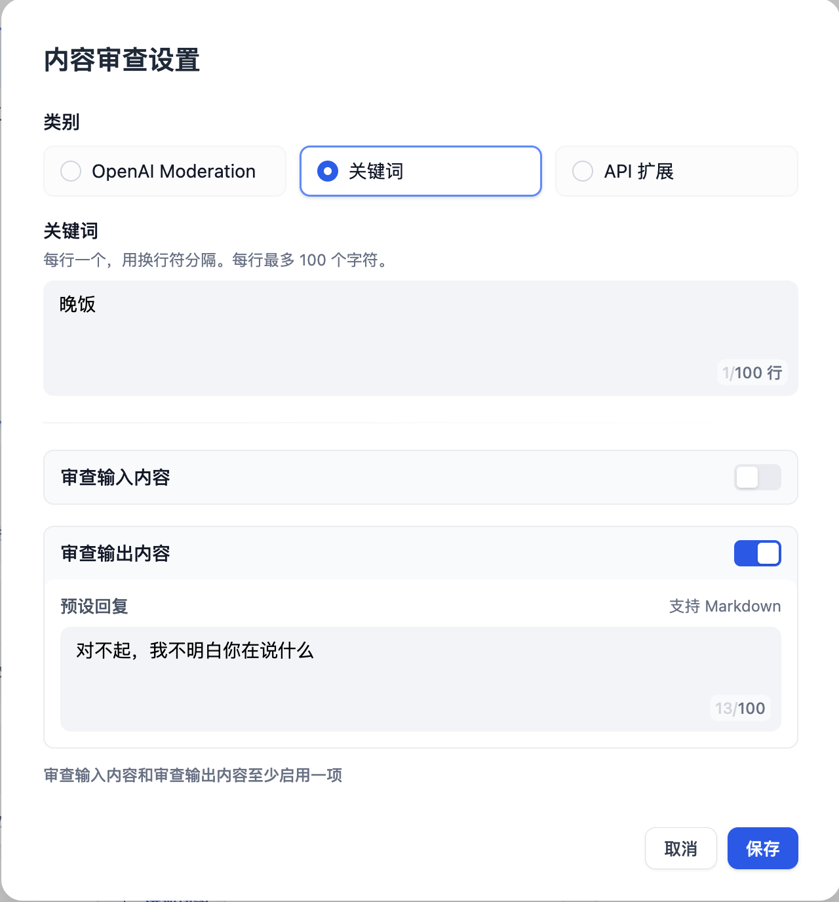

# 如何搭建 AI 图片生成应用

> 作者：Steven Lynn。Dify Technical Writer。

随着图像生成技术的兴起，涌现了许多优秀的图像生成产品，比如Dall-e、Flux、Stable Diffusion等。

本文将以Stablity作为图像生成模型，执导你使用Dify快速开发一个AI图片生成应用。

## 本实验中你将掌握的知识点

- 使用Dify构建Agent的方法
- Agent的基本概念
- 提示词工程的基础知识
- 工具的使用
- 大模型的幻觉的概念

## 1. 获取和填入Stablility API密钥

[点击这里](https://platform.stability.ai/account/keys)即可跳转至Stability的API密钥管理页。

如果你尚未注册，会被要求先注册再进入管理页。

进入管理页后，点击复制密钥即可。


接下来，你需要通过以下步骤把密钥填入 [Dify - 工具 - Stability](https://cloud.dify.ai/tools) 中：

- 登录Dify
- 进入工具
- 选择Stability
- 点击授权

- 填入密钥并保存

## 2. 配置模型供应商

cloud版本的Dify提供了免费200条OpenAI的消息额度

当然，你也可以自定义其他的模型供应商，如下面的步骤所示：


这里以groq为例，groq提供了免费的LLaMA等LLM的调用额度。

登录[groq API管理页](https://console.groq.com/keys)

点击**Create API Key**，设置一个想要的名称并且复制API Key。

回到**Dify - 模型供应商**，选择**groqcloud**，点击**设置**。


粘贴API Key并保存。



## 3. 构建Agent

回到**Dify - 工作室**，选择**创建空白应用**。


在本实验中，我们只需要了解Agent的基础用法即可。


**什么是Agent**

Agent是一种模拟人类行为和能力的AI系统，它通过自然语言处理与环境交互，能够理解输入信息并生成相应的输出。Agent还具有"感知"能力，可以处理和分析各种形式的数据。此外，Agent能够调用和使用各种外部工具和API来完成任务，扩展其功能范围。这种设计使Agent能够更灵活地应对复杂情况，在一定程度上模拟人类的思考和行为模式。


此外，很多人都会将Agent称为“智能体”。

选择**Agent**，填写名称即可。



接下来你会进入到如下图的Agent编排界面


首先，我们选择LLM，本篇教程中我们使用groq提供的Llama-3.1-70B为例：


接下来我们在**工具**中添加Stability：


### 撰写提示词

提示词（Prompt）是Agent的灵魂，直接影响到输出的效果。通常来说越具体的提示词输出的效果越好，但是过冗长的提示词也会导致一些负面效果。

调整提示词的工程，我们称之为提示词工程（Prompt Engineering）

在本次实验中，你不必担心没有掌握提示词工程，我们会在后面循序渐进地学习它。

让我们从最简单的提示词开始：

```
根据用户的提示，使用工具stablility_text2image绘画指定内容
```

用户每次输入命令的时候，Agent都会知晓这样的系统级的指令，从而了解要执行用户绘画的任务的时候需要调用一个叫stability的工具。

例如：画一个女孩，手中拿着一本打开的书


## 发布

点击右上角的发布按钮，发布后选择**运行**就可以获得一个在线运行的Agent的网页。



复制这个网页的URL，可以分享给其他好友使用。

## 思考题1：指定生成图片的画风

我们可以在用户输入的命令中加上画风的指令，例如：二次元风格，画一个女孩，手中拿着一本打开的书


但是如果我们希望风格默认都是二次元风格呢，那么我们加在系统提示词里就行了，因为我们之前了解到系统提示词是每次执行用户命令都会知晓的，优先级更高。

```
根据用户的提示，使用工具stablility_text2image绘画指定内容，画面是二次元风格
```

## 思考题2:拒绝部分用户的某些请求

在许多业务场景中，我们需要避免输出一些不合理的内容，但是LLM很多时候比较“傻”，用户下指令时会照做不误，即使输出的内容是错的，这种模型为了努力回答用户而编造虚假内容的现象称为模型幻觉（Hallucinations），那么我们需要让模型必要的时候拒绝用户的请求。

此外，用户也可能提一些和业务无关的内容，我们也需要让Agent这个时候拒绝请求。

我们可以使用markdown格式给不同的提示词进行划分，将上述教Agent拒绝不合理内容的提示词写到“约束”标题下。当然，这样的格式仅仅是为了规范化，你可以有自己的格式。

```
## 任务
根据用户的提示，使用工具stablility_text2image绘画指定内容，画面是二次元风格

## 约束
如果用户在请求和绘画无关的内容，回复：“对不起，我不明白你在说什么”
```

例如，我们尝试提问：今晚吃什么


在一些更正式的业务场景中，我们可以调用敏感词库来拒绝用户的请求。

在**添加功能 - 内容审查**中添加，这里我们添加关键词“晚饭”，输出“对不起，我不明白你在说什么”


